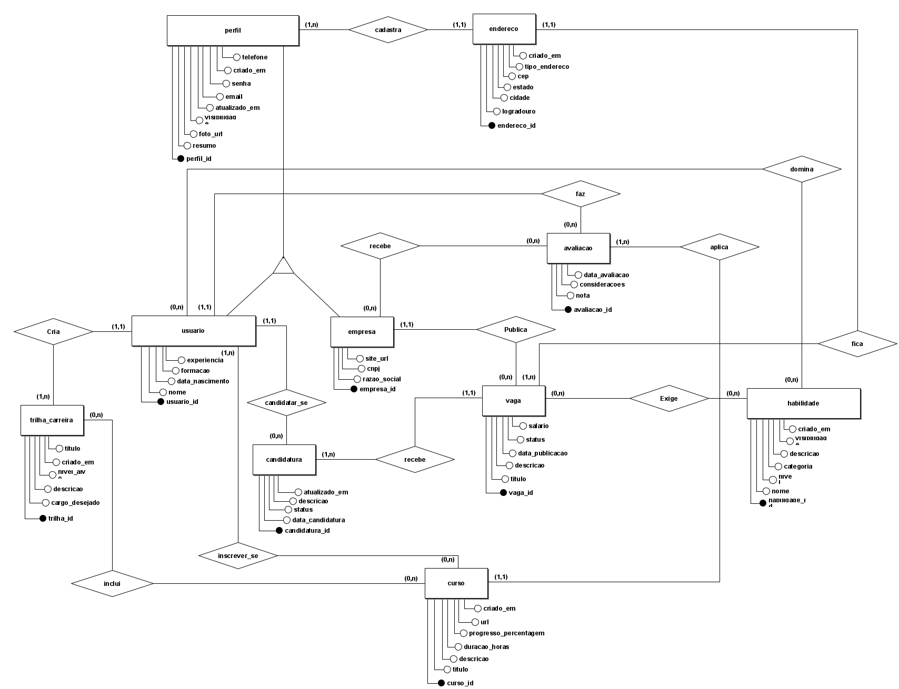

# Banco de Dados 1 - Pathing 

Projeto academico desenvolvido na disciplina de Banco de Dados 1. O sistema Pathing foi modelado para apoiar trilhas de aprendizagem e desenvolvimento profissional.

Este repositorio consolida as entregas de modelagem e implementacao SQL em uma estrutura unica, sem alterar os arquivos originais do acervo academico.

## Etapas

### Etapa 1 - Modelagem

Inclui o modelo conceitual, o modelo logico, suas imagens e o documento da etapa.

### Etapa 2 - Entrega visual

Inclui a imagem disponibilizada no acervo como `Trabalho_Final_Etapa_2.png`.

### Etapa final - Banco PostgreSQL

Os scripts SQL foram reorganizados por responsabilidade:

1. [`01-schema.sql`](sql/01-schema.sql) cria o schema `trabalho`, tabelas, chaves primarias e estrangeiras;
2. [`02-dados.sql`](sql/02-dados.sql) insere dados de exemplo nas tabelas;
3. [`03-consultas.sql`](sql/03-consultas.sql) demonstra consultas, joins, subconsultas, agregacoes, alteracoes, exclusao e uma view.

## Modelo de dados



O banco representa usuarios, empresas, perfis, habilidades, cursos, trilhas, vagas, candidaturas, avaliacoes e tabelas associativas.

## Como executar

O projeto usa PostgreSQL. Crie um banco vazio e execute os scripts na seguinte ordem:

```bash
psql -d nome_do_banco -f sql/01-schema.sql
psql -d nome_do_banco -f sql/02-dados.sql
psql -d nome_do_banco -f sql/03-consultas.sql
```

Ou abra os arquivos no pgAdmin e execute-os na mesma ordem.

Os scripts usam o schema `trabalho` e devem ser executados em uma base de testes. O terceiro script contem comandos destrutivos, como `DELETE` e `DROP TABLE`; nao o execute em uma base com dados importantes.

## Conceitos demonstrados

- Modelagem conceitual e logica;
- DDL e DML;
- Chaves primarias e estrangeiras;
- Relacionamentos 1:N e N:N;
- Joins e subconsultas;
- `NULL`, `LIKE`, `IN`, `ALL` e `EXISTS`;
- `GROUP BY`, `HAVING` e `UNION`;
- Views;
- Atualizacao e exclusao de registros.

## Observacao sobre dados

Os dados inseridos pelos scripts sao exemplos ficticios para fins academicos. Mesmo assim, revise documentos, nomes de integrantes e imagens antes de tornar o repositorio publico.

## Status

Projeto academico concluido.